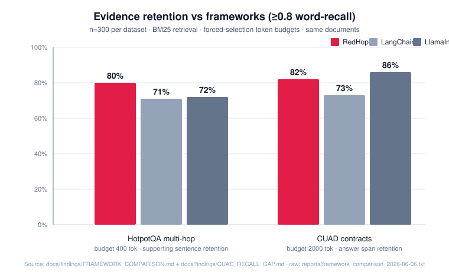
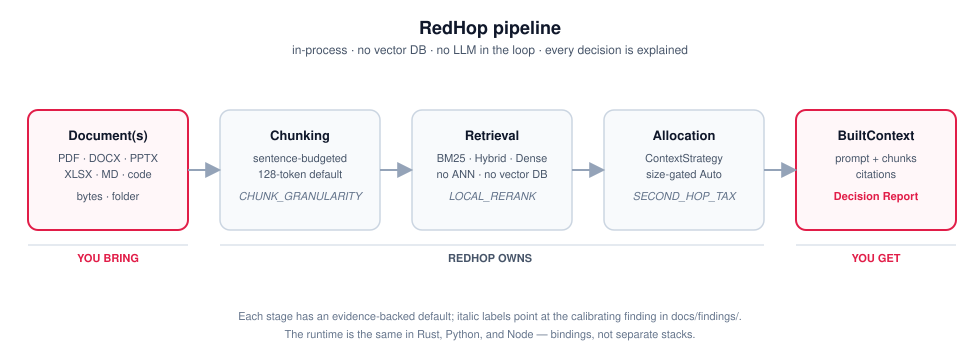
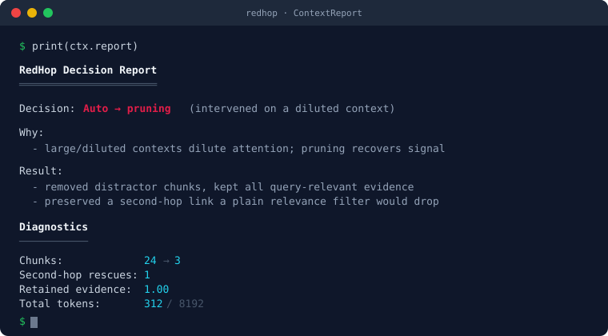
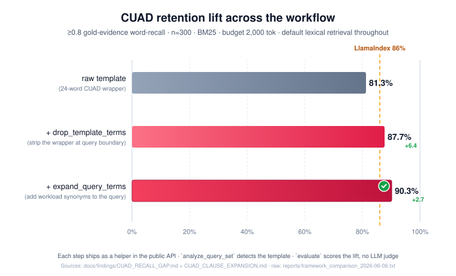

<p align="center">
  
</p>

<h1 align="center">RedHop</h1>

<p align="center"><b>A reasoning-preserving context runtime for RAG.</b></p>

<p align="center">
  <a href="https://pypi.org/project/redhop/"></a>
  <a href="https://crates.io/crates/redhop"></a>
  <a href="https://www.npmjs.com/package/redhop"></a>
  <a href="LICENSE"></a>
  <a href="docs/findings/README.md"></a>
</p>

<p align="center">
Hand it a document and a question. It chunks, retrieves, and allocates the
context your model should actually see — then tells you what it kept, what it
dropped, and why, with citations back to the source. No vector database, no LLM,
all in-process.
</p>

---

## Get started in 60 seconds

```bash
pip install redhop                            # Python  — on PyPI
# OR
cargo add redhop --features files,semantic    # Rust    — on crates.io
# OR
npm install redhop                            # Node.js — on npm
```

```python
import redhop

doc = redhop.Document.from_file("contract.pdf")    # parses + chunks + indexes
ctx = doc.context("What is the governing law?")    # retrieves + assembles
answer = llm.generate(ctx.text())                  # any LLM — no lock-in
```

That's it. `ctx.citations` tells you where the answer came from;
`ctx.report` explains what was kept, dropped, and why. Same three-line
shape in Node and Rust:

```js
const doc = Document.fromFile("contract.pdf");
const ctx = doc.context("What is the governing law?");
```

```rust
let mut doc = redhop::read_file("contract.pdf")?;
let ctx = doc.context("What is the governing law?")?;
```

Already chunked your own content? Skip the file step:

```python
chunks = [redhop.Chunk(text, source=...) for text in my_chunks]
doc = redhop.Document.from_chunks(chunks)
ctx = doc.context("how much did paying users spend last month")
```

No model download for the default lexical tier. Semantic/rerank tiers
auto-download a small ONNX model on first use (cached locally).

---

RedHop is the layer between your documents and the LLM. It is **not** a vector
database, an agent framework, or a workflow engine — it does one thing: turn a
document and a query into the right prompt context, and explain the decision.

The core idea it's built on: **retrieval quality is not the same as reasoning
quality.** Transformers tolerate irrelevant context far better than they tolerate
*missing reasoning links* — so the chunk a multi-hop answer depends on is often
low-relevance to the query and gets silently pruned. RedHop's default keeps it and
makes the trade-off visible. The reasoning behind every default — including the
hypotheses that failed — lives in the [evidence layer](docs/findings/README.md).

## How it compares

Measured on identical documents + budgets + BM25 retrieval, RedHop **beats both
frameworks on multi-hop evidence retention** (80% vs LangChain 71%, LlamaIndex 72%)
and **beats LangChain on contracts** (82% vs 73%). On CUAD's raw-template query
LlamaIndex leads by 4 (LlamaIndex 86% vs RedHop 82% ≥0.8 retention). The
gap is mechanism-known: BM25 dilution from CUAD's fixed 24-word boilerplate.

**Honest fair-preprocessing result** (`bench/compare.py`, n=300, 2026-06-08):
applying `Stripper(boilerplate)` to *every* system's query before retrieval
lifts everyone: LlamaIndex 86% → 94%, RedHop 82% → 88%, LangChain 73% → 79%.
**LlamaIndex actually benefits more from the same Stripper than RedHop does**;
its BM25 retriever is the stronger one on contract-extraction. RedHop reaches
**90.7%** by additionally layering a hand-authored 34-key clause-name
`Vocabulary` dict on top of Stripper — but applying the same recipe to
LlamaIndex was not measured, and given LlamaIndex's bigger lift from the
Stripper step, an unmeasured-but-likely outcome is that LlamaIndex would
match or exceed 90.7% with the same recipe.

What RedHop's CUAD recipe actually offers:
- A reproducible, in-process, audited path from 82% → 87.7% → 90.7%
  using `Stripper` + `Vocabulary` with a Decision Report.
- The Stripper primitive is reusable across any templated workload.
- Not "RedHop beats LlamaIndex by 4.7 points." The retrieval engines are
  roughly comparable on contracts once preprocessing is held constant.

RedHop's clearer architectural lead is **multi-hop retention**, replicated on
two datasets at n=300 each:

- **HotpotQA ≥0.8 retention:** RedHop 80% vs LlamaIndex 72%, LangChain 71% (+8).
- **MuSiQue ≥0.8 retention** (compositional multi-hop, harder): RedHop 22% vs
  LlamaIndex 17%, LangChain 19% (+3 to +5).

Mean recall on MuSiQue is essentially tied with the other two — the ≥0.8
lead is the durable part of the result. Note: `raw_topk` matches
`reasoning_preserving` on both datasets, so the edge is from RedHop's
chunking + BM25 defaults rather than the assembly strategy.

**Want to push multi-hop further?** Switch to `retrieval="hybrid"` (BM25
candidate pool reranked with a small local dense embedder). Measured
lift over RedHop's own BM25 default: **HotpotQA ≥0.8 71% → 83% (+12)**,
**MuSiQue ≥0.5 66% → 74% (+8)** at n=100. Latency cost: ~90-120× per-query
(3ms → 250-400ms p50). Stripper and candidate_k tuning don't help on
multi-hop — the bottleneck is the lexical-vs-semantic gap on bridge
passages, and only dense rerank pierces it.

**Apples-to-apples hybrid vs LangChain/LlamaIndex** (same bge-small model
on all three, n=100, post pure-rerank fix in this branch): HotpotQA —
RedHop hybrid wins (**81%** ≥0.8 vs LangChain 77%, LlamaIndex 67%).
MuSiQue — LangChain still leads narrowly (39% ≥0.8 vs RedHop **34%**,
LlamaIndex 31%). The previously-published RedHop hybrid numbers
(HotpotQA 83%, MuSiQue 26%) used RRF fusion, which buried compositional
bridge passages — now replaced with pure dense rerank (BM25 top-K → dense
sort, code chunks preserved at the tail). Net: −2 HotpotQA, +8 MuSiQue,
closer to the frontrunner on both. Latency unchanged (2-5× slower than
competitors' hybrid) — separate work. See
[`MULTIHOP_HYBRID_COMPETITORS.md`](docs/findings/MULTIHOP_HYBRID_COMPETITORS.md)
+ [`MULTIHOP_CONSTANT_CHUNKING.md`](docs/findings/MULTIHOP_CONSTANT_CHUNKING.md)
+ [`HYBRID_LATENCY_PROFILE.md`](docs/findings/HYBRID_LATENCY_PROFILE.md).

All without a vector database, an agent framework, or model
finetuning. Raw numbers and methodology:
[`docs/findings/FRAMEWORK_COMPARISON.md`](docs/findings/FRAMEWORK_COMPARISON.md)
+ [`MUSIQUE_MULTIHOP.md`](docs/findings/MUSIQUE_MULTIHOP.md)
+ [`MULTIHOP_HYBRID.md`](docs/findings/MULTIHOP_HYBRID.md).

<p align="center">
  
</p>

Methodology + raw runs: [`docs/findings/FRAMEWORK_COMPARISON.md`](docs/findings/FRAMEWORK_COMPARISON.md)
· [`reports/framework_comparison_2026-06-06.txt`](reports/framework_comparison_2026-06-06.txt).

## How it works

<p align="center">
  
</p>

Five stages, in order: **you bring documents and a query**, RedHop owns parsing,
chunking, retrieval, and context allocation, and **you get a `BuiltContext`** with
the assembled prompt, citations, and a Decision Report. Each stage has an
evidence-backed default that traces to a finding in
[`docs/findings/`](docs/findings/) — italic labels in the diagram name the
calibrating one for each stage.

## It explains every decision

Every call returns a **Decision Report** — what it kept, what it dropped, and *why*,
including when it deliberately leaves a small context untouched.

<p align="center">
  
</p>

The same fields are available programmatically — `ctx.report.auto_decision`,
`ctx.report.total_tokens`, `ctx.report.retained_evidence_ratio` — or call
`doc.analyze(query)` to get the report **without** assembling a context (pure
diagnostics).

<details>
<summary>Raw text form (what <code>print(ctx.report)</code> emits)</summary>

```text
RedHop Decision Report
══════════════════════

Decision: Auto → pruning (intervened on a diluted context)

  Why:
    - large/diluted contexts dilute attention; pruning recovers signal density
  Result:
    - removed distractor chunks, kept all query-relevant evidence
    - preserved a second-hop link a plain relevance filter would drop

Diagnostics
───────────
  Chunks:             24 → 3
  Second-hop rescues: 1
```

</details>

## Cite the evidence

Every selected chunk remembers where it came from, so you can show the evidence
trail instead of just pasting text:

```python
for c in ctx.citations:
    print(c["source"], c["page"], c["heading"])
    # contract.pdf  3     None      →  "contract.pdf, p.3"
    # notes.md      None  "Refunds" →  "notes.md → Refunds"
```

`source` plus whichever of `page` / `heading` / `line` the format provides — no
separate store, no second lookup.

## Show your work — query rewrites with an audit trail

Every transformation between the raw query and what BM25 actually saw is
**recorded on the same Decision Report.** Compile a `Stripper` (boilerplate
removal), a `Vocabulary` (workload-curated synonyms), or both, run them as
a chain via `Document.context_with_rewrites(...)`, and the per-stage records
land on `ctx.report.query_rewrites` — what each stage matched, what it
added, what it removed.

```python
import redhop

stripper = redhop.Stripper(["highlight", "the", "parts", "of", "this", "contract"])
vocab    = redhop.Vocabulary({"change of control": ["merger", "successor", "acquisition"]})

doc = redhop.Document.from_file("contract.pdf")
ctx = doc.context_with_rewrites(
    'Highlight the parts of this contract related to "Change of Control".',
    [stripper, vocab],
)

for rec in ctx.report.query_rewrites:
    print(rec.stage, "matched=", rec.matched, "added=", rec.added, "removed=", rec.removed)
# strip       matched=['highlight', 'the', 'parts', 'of', 'this', 'contract']
#             added=[]
#             removed=['highlight', 'the', 'parts', 'of', 'this', 'contract']
# vocabulary  matched=['change of control']
#             added=['merger', 'successor', 'acquisition']
#             removed=[]
```

The same `Vocabulary` works **chunk-side** at ingest via `vocab.enrich(chunk_text)`
— useful for short opaque retrieval units (schema columns, error codes, API
symbols, defined contract terms) where the bare chunk text doesn't tokenize
to the natural-language terms users would query with. Measured on a
Spider-shape sample: curated chunk-side enrichment lifts mean column recall
**+0.19** ([SPIDER_ENRICH](docs/findings/SPIDER_ENRICH.md)); on long prose
chunks it is measured to *hurt*
([CUAD_ENRICH_DEFINITIONS_NULL](docs/findings/CUAD_ENRICH_DEFINITIONS_NULL.md):
−2.0pt). The regime rule predicts which side your corpus is on; A/B with
`redhop.evaluate(...)` against your gold set before adopting.

## Score the change deterministically — no LLM judge

If you're A/B-ing a rewrite (or a retrieval tier, or a strategy), you don't
need an LLM grader. `redhop.evaluate(query, ctx, gold_chunks=[...])` returns
`context_recall`, `context_precision`, `answer_token_recall`, and a
composite `overall` — computed from the **same primitives the Decision
Report uses**, so the eval and the runtime can't disagree by construction.
Zero API calls, deterministic across runs, ~ms per query.

```python
ctx_a = doc.context(user_query)                              # baseline
ctx_b = doc.context_with_rewrites(user_query, [stripper, vocab])
eval_a = redhop.evaluate(user_query, ctx_a, gold_chunks=gold_ids)
eval_b = redhop.evaluate(user_query, ctx_b, gold_chunks=gold_ids)
print("lift on overall:", eval_b.overall - eval_a.overall)
```

Design rationale + the full field list in
[EVALUATE_API](docs/findings/EVALUATE_API.md).

## Loaders

Several on-ramps, all returning a `Document` with the same options:

| On-ramp | For |
| --- | --- |
| `from_text` | text you already have (your own parser/OCR, a DB field) |
| `from_chunks` | content you already chunked — pass `redhop.Chunk(text, source=..., id=..., metadata={...})` instances |
| `from_file` | a file on disk — PDF, DOCX, PPTX, XLSX, Markdown, or text/code |
| `from_bytes` | bytes you fetched yourself — S3 / Azure Blob / GCS / HTTP / DB blobs |
| `from_folder` | a whole directory in one index, with an optional incremental on-disk cache |

Code files are chunked verbatim and labeled with their nearest definition; prose is
sentence-packed; each format carries the structural location it has (page, heading,
line) for citations.

## Retrieval tiers — no vector database

Retrieval is a ladder. Start at the lexical default — it handles most document
QA because the words in the question are usually the words in the answer —
and climb only when the failure shape calls for it. All tiers run in-process,
with no ANN and no index server.

| `retrieval=` | What it does | Reach for it when |
| --- | --- | --- |
| `"lexical"` *(default)* | BM25 — zero dependencies, fully offline, ~50ms warm | most document QA: code, API refs, runbooks, financial reports, handbooks, mixed folders |
| `"hybrid"` | BM25 prunes to a pool, a dense model reorders it | the doc has parallel near-duplicate clauses (regional overrides, per-region sub-sections) — pair with `context(include_heading=True, neighbors=1)` |
| `"semantic"` | dense over every chunk, exact cosine | queries and answers share no vocabulary at all (rare in practice for document QA) |

Set `rerank="cross-encoder"` to add a second-stage scorer that reads each
`(query, passage)` pair jointly — useful for true synonym-mismatch corpora
(HR/support KBs where users phrase things very differently from the docs).
Adds 5–10× query latency, so **verify it helps on your own corpus before
enabling.**

→ Not sure which to pick? See [docs/CHOOSING_A_CONFIG.md](docs/CHOOSING_A_CONFIG.md)
  — the 60-second decision guide with code recipes.

### Language support

The default lexical tier is English-tuned: Snowball Porter2 stemming,
English stopword filtering, and ASCII folding for accented Latin
(`café` ↔ `cafe`, `Süßigkeit` ↔ `Sussigkeit`).

For non-English content, swap the analyzer to any of the 18 Snowball
Porter2 languages (one analyzer drives both BM25 retrieval AND the
grounding scorer, so the two layers can't drift):

```python
# Python
doc = redhop.Document.from_text(german_text, language="german")
```

```javascript
// Node
const doc = Document.fromText(germanText, { language: "german" });
```

```rust
// Rust
use redhop::analyzer::SnowballAnalyzer;
use std::sync::Arc;
let mut doc = redhop::Document::from_text("library", german_text)?
    .with_analyzer(Arc::new(SnowballAnalyzer::german()));
```

Supported: `arabic, danish, dutch, english, finnish, french, german,
greek, hungarian, italian, norwegian, portuguese, romanian, russian,
spanish, swedish, tamil, turkish`. Unknown names error (we don't
silently fall back to English — a typo'd `"germann"` should surface).

For CJK word segmentation (`圧縮アルゴリズム` → `圧縮` + `アルゴリズム`)
or any other custom analyzer, implement the `crate::analyzer::Analyzer`
trait and pass it via `Document::with_analyzer`. See
[docs/LANGUAGE.md](docs/LANGUAGE.md) for the full breakdown, including
a calibration disclaimer (we ship the stemmers, we don't have eval
corpora for non-English so ranking quality on a real domain corpus is
the user's call).

## Assembly strategies

How the context is built from the retrieved candidates. The default is reasoning-preserving;
the others are there when you want a different trade-off.

| `strategy=` | What it does | When |
| --- | --- | --- |
| `reasoning_preserving` *(default)* | keep query-relevant seeds **and** rescue low-relevance chunks linked to a seed; drop only unlinked junk | multi-hop / general |
| `distractor_filtered` | drop everything below a query-grounding bar | single-hop |
| `max_density` | greedily pack the densest chunks into the budget | tight budgets |
| `raw_topk` | keep retrieval order until the budget fills | baseline / no optimization |
| `auto` | size-gated: pass small contexts through untouched, prune large/diluted ones | when you don't want to choose |

## Templated workloads — the +9 retention lift (BM25, no model needed)

If every query in your workload follows a fixed template — legal QA
("*Highlight the parts (if any) of this contract related to X. Details: …*"),
support-ticket triage ("*Help me with X, my account is Y, the error is Z*"),
form-filled queries from a structured UI — **BM25 weights every query term
by corpus IDF, not by how often the term repeats across your query set**.
The boilerplate words dilute the real signal words, and retention suffers.
This is the mechanism that costs raw BM25 four points to LlamaIndex on the
CUAD bench. Closing it doesn't need a vector DB, a different embedder, or a
cross-encoder — it needs two small preprocessing helpers on the query side.

<p align="center">
  
</p>

**Measured on the CUAD framework comparison** (n=300, BM25, budget 2,000 tok):

| step | helper | retention | Δ |
| ---- | ------ | ---------:| -:|
| raw 24-word template | — | 81.3% | — |
| + strip the wrapper | `Stripper` | 87.7% | **+6.4** |
| + add workload synonyms | `Vocabulary` | **90.7%** | **+3.0** |

**RedHop with the full workflow is at 90.7% — beating LlamaIndex by 4 points
on the same setup, at native BM25 latency (~2.5ms/query).** Full mechanism,
worked clause-name dict, and the 4-arm probe in
[`docs/findings/CUAD_CLAUSE_EXPANSION.md`](docs/findings/CUAD_CLAUSE_EXPANSION.md).

The recommended workflow is **detect → strip → (optional) expand → A/B**. The
rewrite chain runs inside `Document.context_with_rewrites(...)` so each
stage's audit trail lands on `report.query_rewrites` automatically.

```python
import redhop

# 1 — Detect. Hand a representative sample of your queries to the analyzer.
report = redhop.analyze_query_set(my_queries[:300])
# report.is_templated:           True / False
# report.template_word_share:    e.g. 0.66 on CUAD
# report.boilerplate_terms:      ["highlight", "contract", "lawyer", …]
# report.estimated_dilution_cost: "high" | "medium" | "low" | "none"

if report.is_templated:
    # 2 — Compile the rewrite chain.
    stripper = redhop.Stripper(report.boilerplate_terms)

    # 3 — (optional) Vocabulary. If your workload has a known taxonomy of
    #    "topics" each with predictable synonyms (clause types, error
    #    codes, issue categories), compile them once.
    vocab = redhop.Vocabulary({
        # YOUR keys → synonyms; CUAD example in CUAD_CLAUSE_EXPANSION.md
        "change of control": ["merger", "successor", "acquisition"],
    })

    # 4 — Run the chain inside context_with_rewrites; the audit trail
    #    lands on ctx.report.query_rewrites automatically.
    doc = redhop.Document.from_file("contract.pdf")
    ctx_a = doc.context(user_query)                              # baseline
    ctx_b = doc.context_with_rewrites(user_query, [stripper, vocab])
    eval_a = redhop.evaluate(user_query, ctx_a, gold_chunks=gold_ids)
    eval_b = redhop.evaluate(user_query, ctx_b, gold_chunks=gold_ids)
    print(eval_b.overall - eval_a.overall)   # the lift, deterministically

    for rec in ctx_b.report.query_rewrites:
        print(rec.stage, "matched=", rec.matched,
              "added=", rec.added, "removed=", rec.removed)
```

A few things worth being explicit about:

- **Only matters if your queries are templated.** `analyze_query_set` is
  conservative by design: HotpotQA and MuSiQue both register quiet
  (`is_templated=False`) in the cross-workload probe; CUAD fires. If yours
  doesn't fire, skip this section.
- **The analyzer measures the *shape* of your query set, not your
  retention.** It says "this *looks* like a templated workload" with the
  boilerplate terms it found; it does **not** promise a specific lift.
  Always A/B on your gold-evidence sample before committing.
- **For single-doc extraction workloads also set `strategy="raw_topk"`.**
  The `auto` policy routes large contexts to `reasoning_preserving`, which
  solves a multi-hop problem contract extraction doesn't have. RawTopK
  beats it by ~4 points at every chunk size on CUAD.
- **We deliberately don't ship a CUAD-specific `strip_template()` helper.**
  Templates are workload-specific; baking one in would make the wrong
  call for the next workload. `Stripper(...)` and `Vocabulary({...})`
  take *your* boilerplate / synonym dict so the call stays on your side.
- **Or take the one-knob alternative — `retrieval="hybrid"`.**
  Dense retrieval reads chunks as semantic content rather than counting
  tokens, so the boilerplate ratio stops mattering. It substitutes for
  template stripping by a different mechanism (+5.3 on the raw CUAD query
  at ~10ms/query). On CUAD specifically, BM25 + strip + expand still wins
  on retention AND latency (90.3% / 2.5ms vs hybrid+CE 89.0% / 683ms);
  the two paths are *substitutes*, not complements — pick one.
  See [`docs/findings/CUAD_HYBRID_RERANK.md`](docs/findings/CUAD_HYBRID_RERANK.md)
  for the 6-arm probe and the substitute-not-stack rule.

| helper | what it does | finding |
| ------ | ------------ | ------- |
| `analyze_query_set(queries)` | Inspects a sample of your queries; flags whether they're templated and which terms are doing the dilution | [QUERY_SET_ANALYZER](docs/findings/QUERY_SET_ANALYZER.md) (cross-workload probe: CUAD fires, HotpotQA + MuSiQue stay quiet) |
| `Stripper(boilerplate)` | Compiled token-level boilerplate strip; word-boundary safe (an `"of"` strip does not erase `"of"` inside `"office"`). Plugs into the rewrite chain so the audit trail is captured | [CUAD_RECALL_GAP](docs/findings/CUAD_RECALL_GAP.md) · [MULTILINGUAL_ANALYZER](docs/findings/MULTILINGUAL_ANALYZER.md) |
| `Vocabulary({key: [synonyms]})` | Compiled workload-curated equivalence classes — appends high-IDF synonyms when the token-level key matches. `Vocabulary.bidirectional({...})` for symmetric maps (PTO ↔ paid time off). Opposite mechanism to PRF (falsified) | [CUAD_CLAUSE_EXPANSION](docs/findings/CUAD_CLAUSE_EXPANSION.md) |
| `vocab.enrich(chunk_text)` | Chunk-side mirror. **Use it when your retrieval units are short and opaque** (schema columns, error codes, API symbols, defined contract terms) — appended workload-curated tokens raise the chunk's matchable surface so natural-language queries can land. **Measured to lift retrieval +0.19 mean recall on Spider-shape schemas.** Measured to *hurt* (−2.0pt) on long prose chunks — don't use it there. A/B with `redhop.evaluate(...)` against your gold before adopting | [SPIDER_ENRICH](docs/findings/SPIDER_ENRICH.md) + [VOCABULARY_ENRICH](docs/findings/VOCABULARY_ENRICH.md) + [CUAD_ENRICH_DEFINITIONS_NULL](docs/findings/CUAD_ENRICH_DEFINITIONS_NULL.md) |
| `Document.context_with_rewrites(query, [stripper, vocab])` | Runs the chain through retrieval and records per-stage audit on `report.query_rewrites` | (same finding as above) |
| `evaluate(query, ctx, gold_chunks, gold_answer)` | Deterministic A/B scoring against gold; no LLM judge. Refraction of the same primitives the Decision Report uses, so eval and runtime can't disagree | [EVALUATE_API](docs/findings/EVALUATE_API.md) |

Decision rule + the recipe in full:
[`docs/CHOOSING_A_CONFIG.md` → "Templated queries with heavy boilerplate"](docs/CHOOSING_A_CONFIG.md).

## Documentation

- **Choosing a configuration**: [docs/CHOOSING_A_CONFIG.md](docs/CHOOSING_A_CONFIG.md) — 60-second decision guide
- **Retrieval & context tips**: [docs/retrievaltips.md](docs/retrievaltips.md)
- **Comparison** (vs LangChain / LlamaIndex): [docs/COMPARISON.md](docs/COMPARISON.md)
- **Architecture**: [docs/ARCHITECTURE.md](docs/ARCHITECTURE.md)
- **Evidence layer** (every finding, including the falsified ones): [docs/findings/](docs/findings/README.md)
- **Python**: [python/README.md](python/README.md) · **Node**: [nodejs/README.md](nodejs/README.md)
- **API stability**: [docs/API_STABILITY.md](docs/API_STABILITY.md) ·
  **FAQ**: [FAQ.md](FAQ.md) · **Changelog**: [CHANGELOG.md](CHANGELOG.md)

## References

RedHop is engineering, not a research paper — but the pieces it leans on are
each grounded in named, citable work. The findings under
[`docs/findings/`](docs/findings/) document where each piece earned its place.

**Retrieval primitives**

- **BM25.** Robertson, S. & Zaragoza, H. (2009). *The Probabilistic Relevance
  Framework: BM25 and Beyond.* Foundations and Trends in IR.
  → drives `RetrievalMode::Lexical` and the lexical leg of `RetrievalMode::Hybrid`.
- **Snowball Porter2 stemming.** Porter, M. F. (2001). *Snowball: A language for
  stemming algorithms.* → the default `crate::analyzer::SnowballAnalyzer` (18
  languages); one analyzer drives BM25 *and* the grounding scorer so the two
  layers can't drift.
- **Reciprocal Rank Fusion (RRF).** Cormack, G., Clarke, C. & Büttcher, S. (2009).
  *Reciprocal Rank Fusion outperforms Condorcet and individual rank learning
  methods.* SIGIR. → `crate::retrieval::fusion::reciprocal_rank_fusion`, used
  by `LocalRerankRetriever` and `HybridRetriever`.

**Failure modes we observed and adopted from the literature**

- **Lost-in-the-middle context dilution.** Liu, N. et al. (2023). *Lost in the
  Middle: How Language Models Use Long Contexts.* arXiv:2307.03172. → motivates
  the size-gated `ContextStrategy::Auto`; the measured crossover lives in
  [`docs/findings/CONTEXT_DILUTION.md`](docs/findings/CONTEXT_DILUTION.md).
- **Query Performance Prediction (QPP) & NQC.** Shtok, A., Kurland, O. & Carmel,
  D. (2012). *Predicting Query Performance by Query-Drift Estimation.* ACM TOIS.
  → probed as a candidate cross-encoder gate signal in
  [`docs/findings/RERANKING_LIMITS.md`](docs/findings/RERANKING_LIMITS.md)
  (negative result, documented honestly).
- **Multi-hop Dense Retrieval (MDR).** Xiong, W. et al. (2021). *Answering
  Complex Open-Domain Questions with Multi-Hop Dense Retrieval.* ICLR. →
  the single-pass re-encode variant we tested and falsified in
  [`docs/findings/DENSE_RERANK_CEILING.md`](docs/findings/DENSE_RERANK_CEILING.md).

**Evaluation datasets**

- **HotpotQA.** Yang, Z. et al. (2018). *HotpotQA: A Dataset for Diverse,
  Explainable Multi-hop Question Answering.* EMNLP. → primary multi-hop benchmark
  in nearly every finding here.
- **MuSiQue.** Trivedi, H. et al. (2022). *MuSiQue: Multi-hop Questions via
  Single-hop Question Composition.* TACL. → the harder multi-hop corpus where
  several "obvious" improvements were measured to NOT generalize
  ([`docs/findings/MUSIQUE_RECALL_GAP.md`](docs/findings/MUSIQUE_RECALL_GAP.md)).
- **CUAD.** Hendrycks, D. et al. (2021). *CUAD: An Expert-Annotated NLP Dataset
  for Legal Contract Review.* NeurIPS. → the contracts workload in the
  framework comparison and document-eval findings.

## License

Apache-2.0 — see [LICENSE](LICENSE) and [NOTICE](NOTICE).
